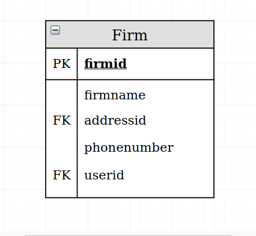
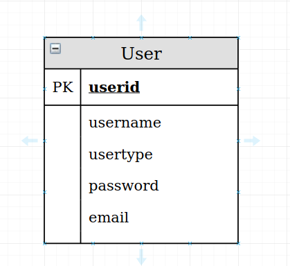
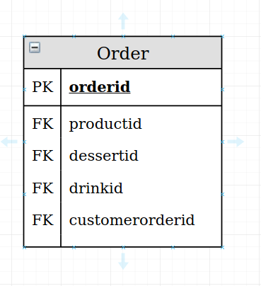

Parts Implemented by Cihat Bostancı
================================

This web application is developed with Python's Flask library.
In this web application, PostgreSQL is used for relational database.

Database Design
---------------

I have 4 tables in our databases model. 

Table Distribution
^^^^^^^^^^^^^^^^^^^
:Cihat BOSTANCI:

   * FIRM
   * CUSTOMER
   * USER
   * ORDER
   
Firm table is given in Figure 1.

Customer table is given in Figure 2.

.. figure:: diagrams/customer.png
   :scale: 20 %
   :alt: map to buried treasure
User table is given in Figure 3.

 
Order table is given in Figure 4.

   
   

.. toctree::

   member1
   member2

